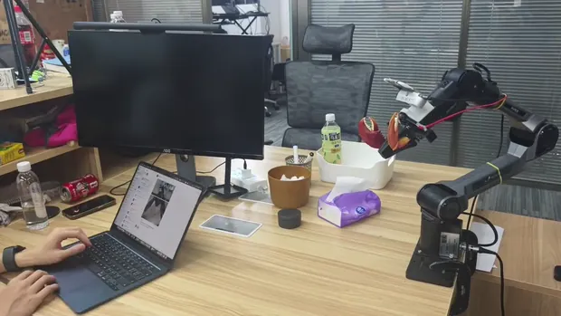
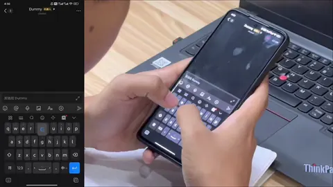
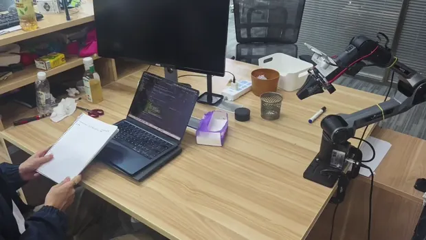
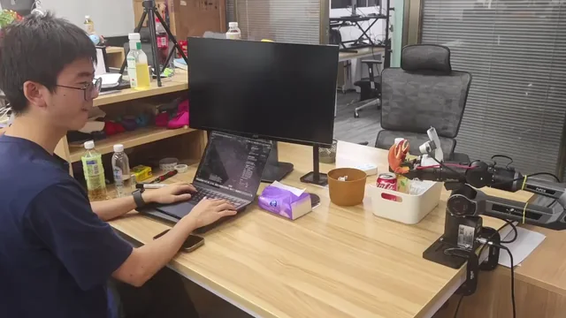

# VLAPilot: A Scheduling Agent for Vision-Language-Action Models

[Project page](https://jinghangli.github.io/vlapilot/) |
[License](LICENSE)

VLAPilot turns short-horizon VLA skills into long-horizon robot missions. It
pairs a VLM planner with a separate VLM verifier, keeps every step explicit and
traceable, and drives the robot through an MCP backend that owns hardware
control.

This repository uses a controlled plan-mode pipeline:

```text
Nanobot / CLI
  -> vlapilot.interface.mcp_server     # planner MCP server
  -> vla_pi05_piper.server             # Pi0.5/Piper backend MCP server
  -> VLARuntime / RTCExecutor          # arm execution plus verification
```

The planner observes the scene, emits a strict JSON plan, validates each step
against the trained task vocabulary, and then executes the approved plan one
step at a time. The verifier compares baseline and current camera frames after
each step starts, so the system can continue, stop, or fail with a concrete
reason.

## Capabilities

Desk-cleaner demos cover direct interaction, object hand-over, object
placement, and multi-step plan -> act -> verify missions. Preview assets live
under `examples/demo/previews/`; raw clips can be placed under `examples/demo/`
as described in `examples/demo/README.md`.

### Multi-Step Missions

<table width="100%">
  <tbody>
    <tr>
      <td width="50%" align="center" valign="top">
        <b>Clean up the desk</b><br>
        <sub>multi-step | autonomous | 1x</sub><br><br>
        <video width="520" controls playsinline preload="metadata" poster="examples/demo/previews/clean_desk.webp">
          <source src="https://jinghangli.github.io/vlapilot/demo/cleandesk.mp4" type="video/mp4">
        </video>
      </td>
      <td width="50%" align="center" valign="top">
        <b>Wrap up the desk</b><br>
        <sub>multi-step | autonomous | 1x</sub><br><br>
        <video width="520" controls playsinline preload="metadata" poster="examples/demo/previews/close_laptopv2.webp">
          <source src="https://jinghangli.github.io/vlapilot/demo/offduty.mp4" type="video/mp4">
        </video>
      </td>
    </tr>
  </tbody>
</table>

### Object Hand-Over

<table width="100%">
  <tbody>
    <tr>
      <td width="33%" align="center" valign="top">
        <b>Hand me the bottle</b><br>
        <sub>single-step | 1x</sub><br><br>
        
      </td>
      <td width="33%" align="center" valign="top">
        <b>Hand me the screwdriver</b><br>
        <sub>single-step | 1x</sub><br><br>
        
      </td>
      <td width="33%" align="center" valign="top">
        <b>Hand me a pen</b><br>
        <sub>single-step | 1x</sub><br><br>
        
      </td>
    </tr>
  </tbody>
</table>

### Direct Interaction

<table width="100%">
  <tbody>
    <tr>
      <td width="50%" align="center" valign="top">
        <b>Wave hello</b><br>
        <sub>single-step | 1x</sub><br><br>
        
      </td>
      <td width="50%" align="center" valign="top">
        <b>More demos</b><br>
        <sub>add MP4 clips or generated previews under examples/demo/</sub><br><br>
        <a href="examples/demo/README.md">Demo asset guide</a>
      </td>
    </tr>
  </tbody>
</table>

## How It Works

An upstream caller, such as Nanobot or the CLI, sends a high-level goal to
VLAPilot. The planner MCP server captures camera frames from the backend,
builds a planner prompt from the active mission, and asks the planner VLM for a
strict JSON plan:

```json
{
  "steps": [
    {
      "step": 1,
      "instruction": "Put the bottle into the white box.",
      "completion_mode": "single",
      "rationale": "The bottle is large and blocks the workspace."
    }
  ]
}
```

Every `instruction` must exactly match the intersection of:

- the mission vocabulary in `examples/missions/<name>/tasks.yaml`
- the robot capability vocabulary configured by `arm.capability_tasks_file`

After approval, `vla_execute` starts the plan in the background. For each step,
VLAPilot calls the backend `vla_start(..., verify_mode="manual")`, polls
`vla_verify_once`, saves observations and events, and then moves to the next
step only after the verifier returns `completed`. A failure verdict, timeout,
or backend error stops the whole plan and records the reason.

## Quickstart

Python 3.10 or higher is required.

### 1. Install

```bash
git clone https://github.com/JinghangLi/vlapilot.git
cd vlapilot
python3.10 -m venv .venv
source .venv/bin/activate
pip install -e .[dev]
```

Install the example backend dependencies when running the real Pi0.5/Piper
robot stack:

```bash
pip install -e .[examples]
```

### 2. Configure

```bash
mkdir -p ~/.vlapilot
cp config.example.json ~/.vlapilot/config.json
```

Edit `~/.vlapilot/config.json`:

- `agent.planner.api_key`: LLM key for the planner
- `agent.mission_dir`: path to a mission directory
- `arm.verify.providers.*`: VLM provider config for verification
- `arm.capability_tasks_file`: task vocabulary supported by the backend
- `arm.mcp_command` and `arm.mcp_args`: backend MCP server command

Config lookup order:

1. Explicit `--config`
2. `~/.vlapilot/config.json`
3. `~/.vla/config.json`

### 3. Run

Run one mission directly from the CLI:

```bash
python3 scripts/run_agent.py \
  --config ~/.vlapilot/config.json \
  --instruction "Clean up everything on the desk."
```

Expose the planner MCP server to Nanobot or another upstream agent:

```bash
vlapilot --config ~/.vlapilot/config.json
```

Start the robot backend directly when debugging lower-level runtime behavior:

```bash
vla-pi05-piper --config ~/.vlapilot/config.json
```

Use the local REPL to exercise either MCP layer:

```bash
python3 scripts/mcp_repl.py --server agent --config ~/.vlapilot/config.json
python3 scripts/mcp_repl.py --server arm --config ~/.vlapilot/config.json
```

## MCP Tools

The outer planner MCP server exposes:

| Tool | Purpose |
|------|---------|
| `vla_scene` | Capture the current scene and return observation text plus saved image paths. |
| `vla_plan` | Create a JSON plan from a high-level instruction and the current scene. |
| `vla_execute` | Execute the currently generated plan in the background. |
| `vla_progress` | Report current step, completed steps, final status, and failure reason. |
| `vla_stop` | Stop the active plan and stop the robot arm. |

The backend robot MCP server exposes:

| Tool | Purpose |
|------|---------|
| `vla_observe` | Capture robot camera observations. |
| `vla_start` | Start one vocabulary-locked VLA task. |
| `vla_status` | Return the backend runtime state. |
| `vla_verify_once` | Run one manual verification pass. |
| `vla_stop` | Stop the current backend task. |

## Extend

### Bring Your Own VLA

Wrap a robot in a stdio MCP server that exposes the backend tools listed above.
VLAPilot talks to that server through `ArmClient`, so the planner and robot do
not need direct Python coupling. The bundled reference backend lives in
`examples/vla_pi05_piper/`.

### Bring Your Own Mission

A mission is a directory of runtime inputs:

```text
my_mission/
|-- mission.md       # user-facing mission notes and compatibility guidance
|-- mission_mcp.md   # planner prompt for plan-mode execution
|-- tasks.yaml       # executable task vocabulary
`-- verify.md        # verifier prompt and success criteria
```

Point `agent.mission_dir` at the mission directory and keep
`arm.capability_tasks_file` aligned with the same task vocabulary.

## Project Layout

```text
vlapilot
|-- src/vlapilot/
|   |-- agent.py                     # one-shot CLI plan pipeline
|   |-- interface/mcp_server.py      # planner MCP server used by Nanobot
|   |-- backend/mcp_client.py        # backend MCP client
|   `-- core/
|       |-- plan.py                  # planner output parsing and validation
|       |-- execution.py             # shared step execution and verify loop
|       |-- mission.py               # mission, task, and prompt loading
|       `-- session.py               # JSONL sessions and media files
|
|-- examples/vla_pi05_piper/         # Pi0.5/Piper backend MCP server
|-- examples/missions/desk_cleanup/  # reference mission
|-- examples/demo/                   # demo previews and clip guide
|-- scripts/                         # CLI, MCP REPL, prompt testing helpers
`-- tests/                           # pytest regression tests
```

## Sessions and Debugging

Each run writes a session under `agent.session_dir`:

```text
~/.vlapilot/sessions/
|-- m_<timestamp>.jsonl
`-- m_<timestamp>/
    |-- events.jsonl
    `-- media/
        |-- plan-001-frame.jpg
        `-- exec-step-1-002-frame.jpg
```

When `arm.verify.debug=true`, the backend verifier also writes request,
response, baseline, and current-frame artifacts under `debug/verify/`.

## Testing

Run the main regression suite:

```bash
pytest -q tests
```

Run only the core MCP/runtime path:

```bash
pytest tests/test_agent_mcp.py tests/test_runtime.py tests/test_server_resources.py
```

After changing `examples/missions/*/verify.md`, run the verify prompt
regression test:

```bash
python3 scripts/test_verify_prompt.py examples/missions/desk_cleanup/verify.md
```

## Contributors

- Jinghang Li
- Qing Lian
- Yuhan Xi
- Qing Jiang

## License

MIT
